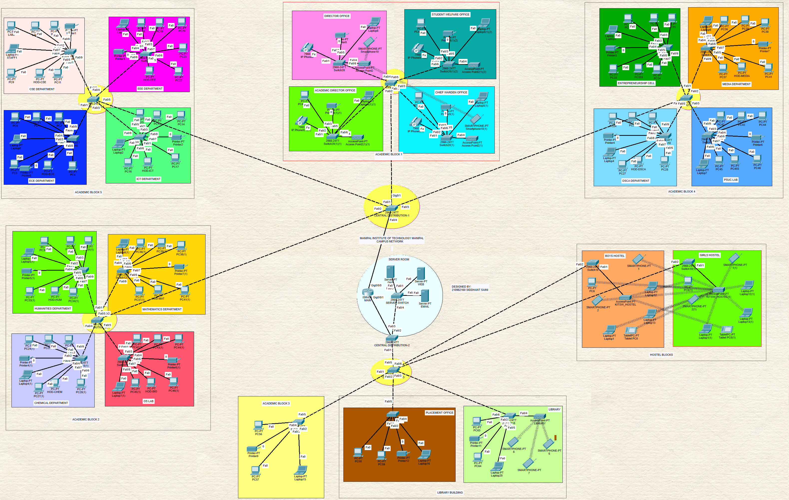
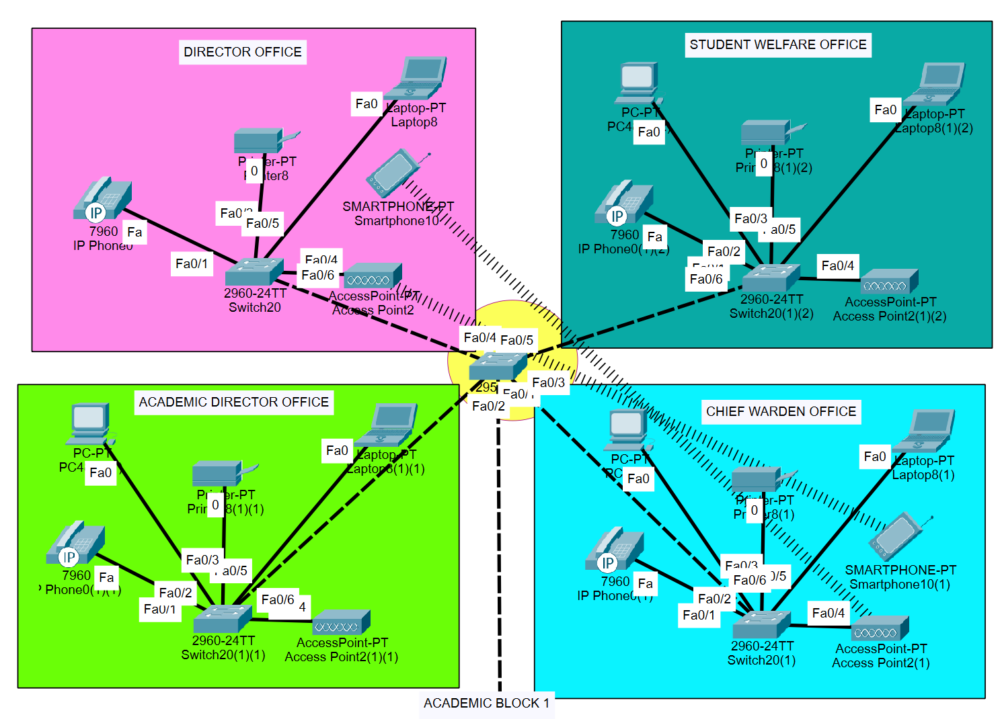
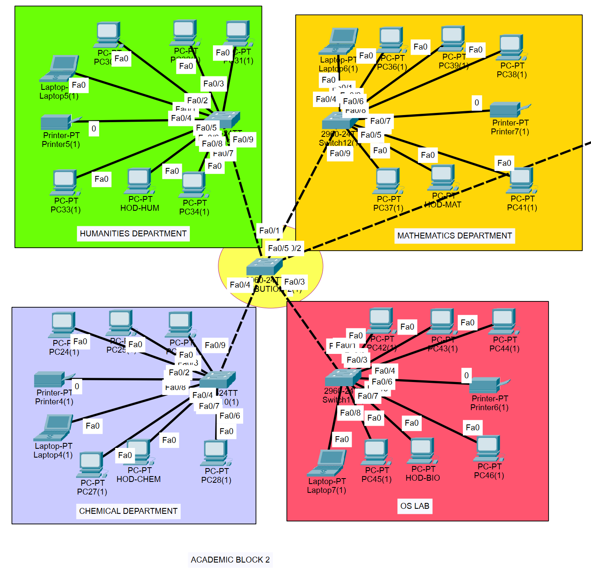
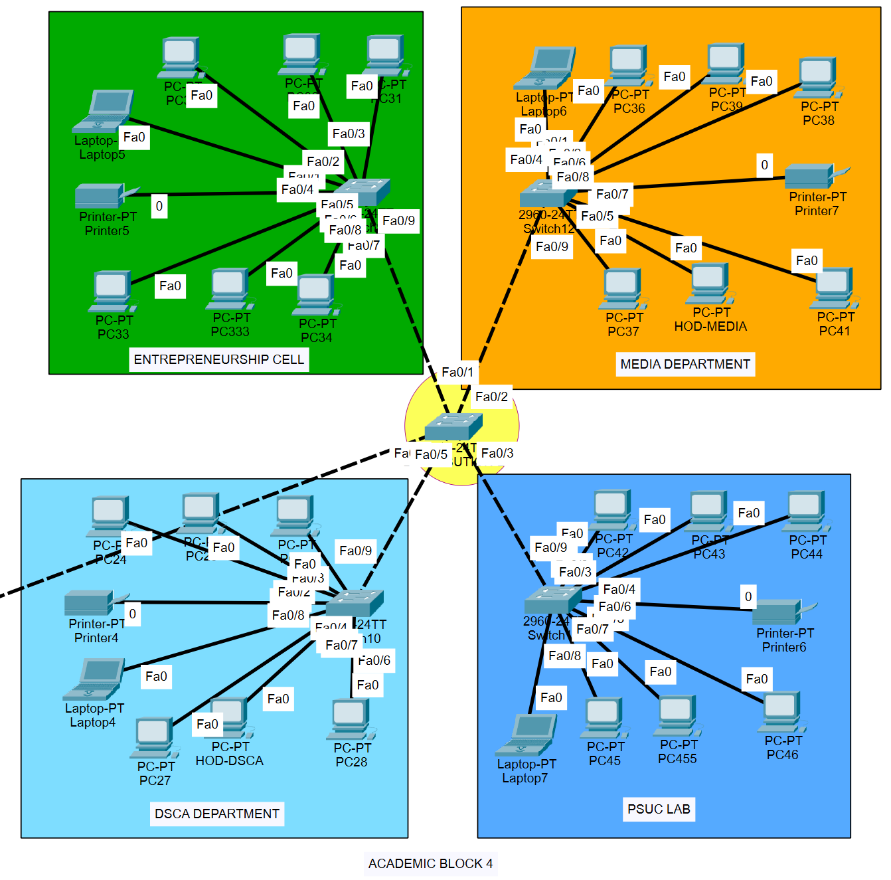
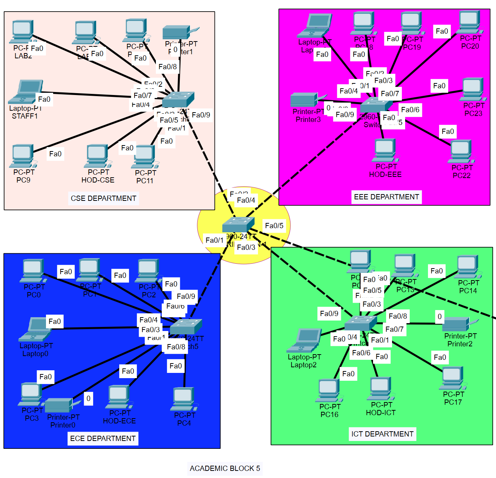
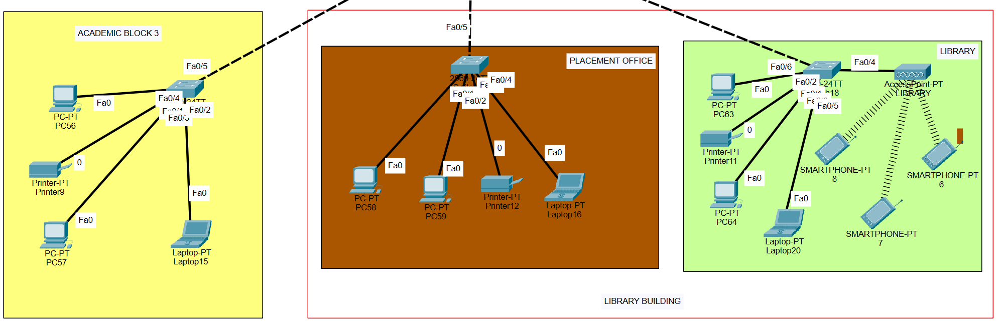
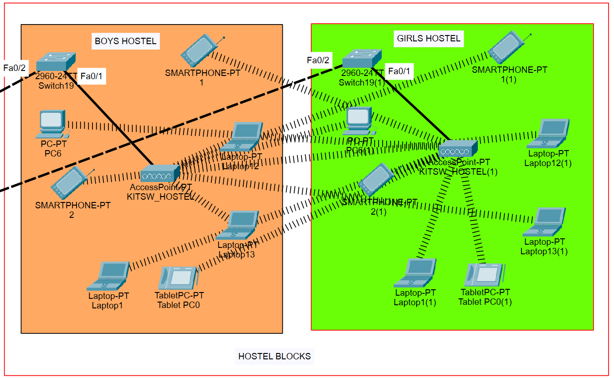
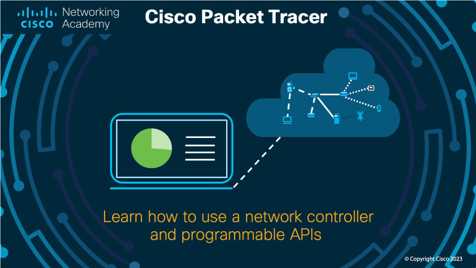

# Campus Cyber Security Enhancement Project - Cisco Virtual Internship 2024

## Overview
This repository houses all the essential files and comprehensive documentation for the Campus Cyber Security Enhancement Project, undertaken as part of the Cisco Cyber Security Industry Problem Statement within the Virtual Summer Internship Program for the year 2024. The primary focus of this project is to conduct a thorough analysis and subsequent enhancement of the cyber security protocols currently implemented within the network infrastructure at the Manipal Institute of Technology. The aim is to assess the effectiveness of existing security measures and to identify and integrate advanced security solutions to bolster the campus network's resilience against cyber threats. This initiative not only enhances network security but also provides a practical learning experience for interns, aligning with industry standards and expectations.

### Overall Structure

## Project Components

### 1. Network Analysis and Mapping
The primary goal is to assess the existing campus network, focusing on identifying the security infrastructure in place, which includes intrusion detection systems, firewalls, and authentication protocols. The Cisco Packet Tracer tool is utilized for visualizing and mapping the network topology.

### 2. Attack Surface Mapping
The objective here is to perform a detailed analysis of the attack surface to uncover potential vulnerabilities and recommend stronger security measures. The assessment covers identifying open ports, weak passwords, and outdated firmware, and suggests enhancements to encryption protocols and firewall configurations.

### 3. Hybrid Working Environment
The aim is to design a secure hybrid working environment tailored for faculty and students that provides safe access both on-campus and remotely. Proposed solutions include the implementation of VPNs, Network Access Control (NAC), Multi-Factor Authentication (MFA), and Cloud Access Security Broker (CASB).

### 4. Content Access Restriction
This task involves developing a network solution that limits access to non-educational websites, ensuring students can only reach approved web content. The strategy includes deploying Cisco Umbrella for DNS filtering and Cisco Firepower for advanced firewall protection.

## Network Topology Screenshots

### Campus Network Topology Screenshots
Here are the visual representations of the campus network topology as designed in Cisco Packet Tracer, located in the `screenshots` folder.

#### Screenshot 1: Academic Block 1

#### Screenshot 2: Academic Block 2

#### Screenshot 3: Academic Block 4

#### Screenshot 4: Academic Block 5

#### Screenshot 5: AB3 & Library Building

#### Screenshot 6: Hostel blocks

## Files Included in the Repository
- **Packet Tracer Network File**: A `.pkt` file containing the simulated network topology.
- **Cyber Security Project Report**: A comprehensive document detailing the network analysis, proposed enhancements, and the reasoning behind each security measure.
- **Problem Statement PDF**: Outlines the tasks and deliverables expected for the project.

## Installation and Usage
- **Cisco Packet Tracer**: To view the `.pkt` file, Cisco Packet Tracer must be installed. This software allows for the simulation and testing of network setups.

## Contributing
Contributions to this project are welcome. Please fork the repository and submit a pull request with your proposed changes.

## Contact
For any inquiries or further assistance regarding this project, please contact:

- **Name**: Siddhant Saini
- **Email**: [siddhantsaini3536@gmail.com](mailto:siddhantsaini3536@gmail.com)
